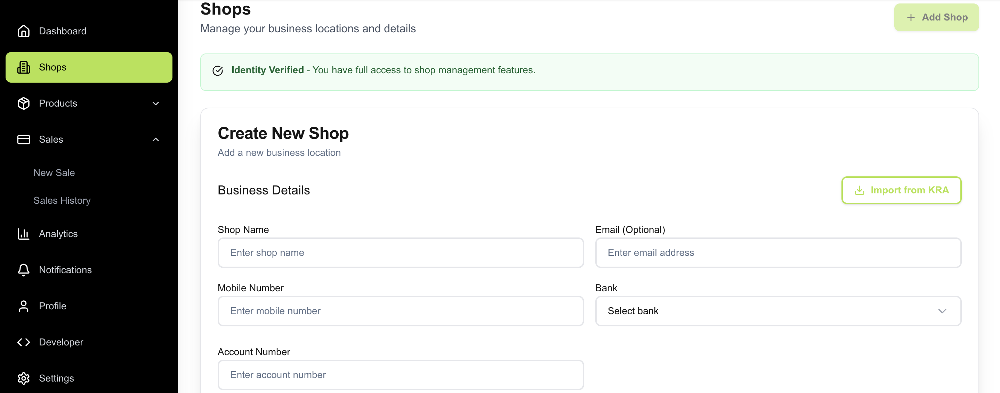
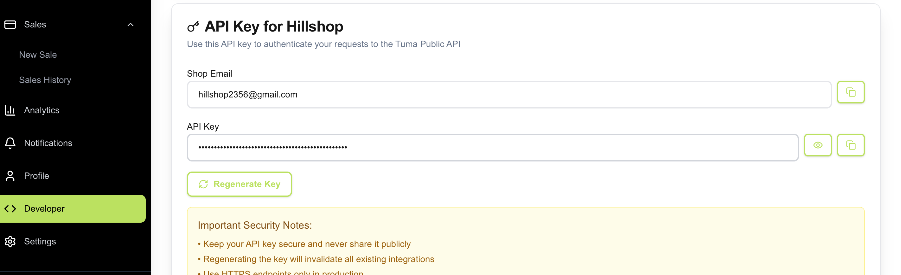
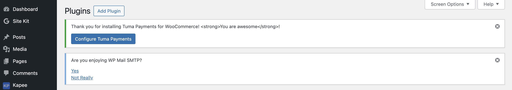
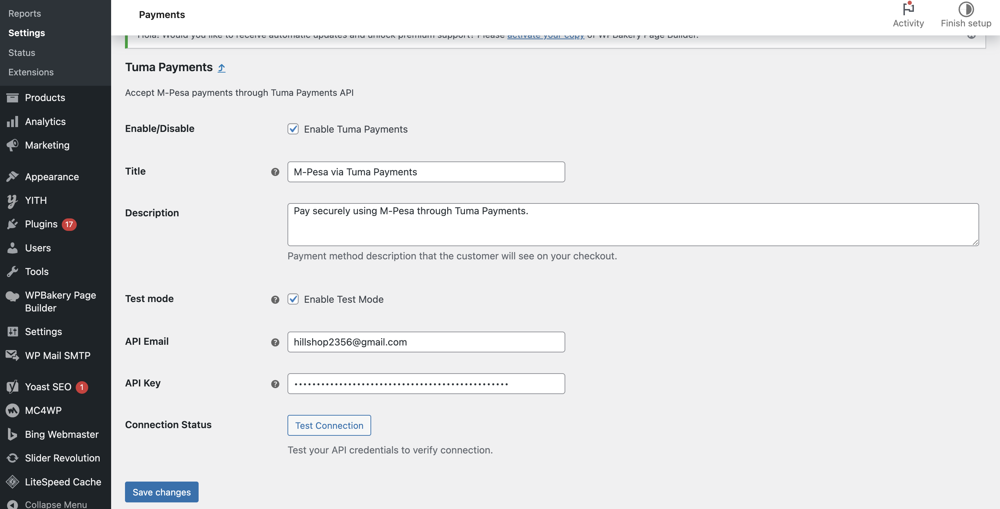

# Tuma Payments for WooCommerce

Accept M-Pesa payments to any bank account through the Tuma Payments API in your WooCommerce store.

## Getting Started

### Step 1: Create Your Tuma Payments Account
1. Visit [https://merchant.tuma.co.ke](https://merchant.tuma.co.ke) and sign up for a merchant account
2. Complete the registration process and verify your account

### Step 2: Set Up Your Shop
1. Login to your Tuma Payments merchant dashboard
2. Navigate to **Shops** section and create a new shop
   
   

### Step 3: Get Your API Credentials
1. Go to the **Developer** section in your dashboard
2. Copy your **Shop Email** and **API Key**
   
   

## Installation

### Step 4: Download and Install Plugin
1. Download the plugin from [https://tuma.co.ke/wc-tuma.zip](https://tuma.co.ke/wc-tuma.zip)
2. Upload the plugin to your WordPress site:
   - Go to **Plugins > Add New > Upload Plugin**
   - Choose the downloaded zip file and click **Install Now**
3. Activate the plugin through the 'Plugins' menu in WordPress

### Step 5: Configure the Plugin
1. Go to **WooCommerce > Settings > Payments**
2. Find **Tuma Payments** and click **Configure**
   
   

3. Enter your credentials:
   - **Shop Email**: The email from your Developer section
   - **Shop API Key**: The API key from your Developer section
   
   

4. Click **Test Connection** to verify your credentials
5. Enable the payment method and save settings

## Notification Setup

### Real-time Payment Notifications
Get instant Payment alerts via WhatsApp, Telegram and Slack.

#### Configure Notifications
1. Navigate to **Notifications**: In your merchant dashboard, go to the "Notifications" tab

#### Configure Telegram:
1. Click "Setup Telegram Notifications"
2. Follow the bot setup instructions
3. Enter the verification code

#### Configure WhatsApp:
1. Enter your WhatsApp API token
2. Provide your WhatsApp phone number
3. Click "Activate WhatsApp Notifications"

## Features

- **Real-time Payment Status**: Customers see live payment confirmation
- **STK Push Integration**: Seamless M-Pesa payment experience
- **Payment Retry**: Customers can resend STK push if needed
- **Receipt Display**: M-Pesa receipt numbers shown to customers
- **Order Management**: Automatic order status updates
- **Comprehensive Logging**: Detailed payment notes in order history

## Requirements

- WordPress 4.6+
- WooCommerce 3.5.0+
- PHP 7.0+
- Active Tuma Payments merchant account
- Valid Kenyan M-Pesa phone number for testing

## Troubleshooting

### Common Issues

1. **"Connection Failed" Error**
   - Verify your Shop Email and API Key are correct
   - Ensure your Tuma Payments account is active and verified

2. **STK Push Not Received**
   - Check that the phone number is registered with M-Pesa
   - Ensure the phone number format is correct (254XXXXXXXXX)

3. **Payment Status Not Updating**
   - Verify your webhook URL is accessible
   - Check that your site has a valid SSL certificate

## Support and Resources

### Documentation
- **API Documentation**: [https://github.com/matatashadrack/tuma-mpesa-stk-push](https://github.com/matatashadrack/tuma-mpesa-stk-push)
- **Merchant Portal**: [https://merchant.tuma.co.ke](https://merchant.tuma.co.ke)

### Support Channels
- **Email**: support@tuma.co.ke
- **Phone**: +254722854082 / +254733854082
- **Twitter**: [@tumaonline](https://twitter.com/tumaonline)
- **Business Hours**: Monday - Friday, 8:00 AM - 6:00 PM EAT

### Getting Help

For technical support and questions:
- Email: support@tuma.co.ke
- Documentation: [https://merchant.tuma.co.ke/docs](https://merchant.tuma.co.ke/docs)

## License

This plugin is licensed under the GPL v3 or later.
